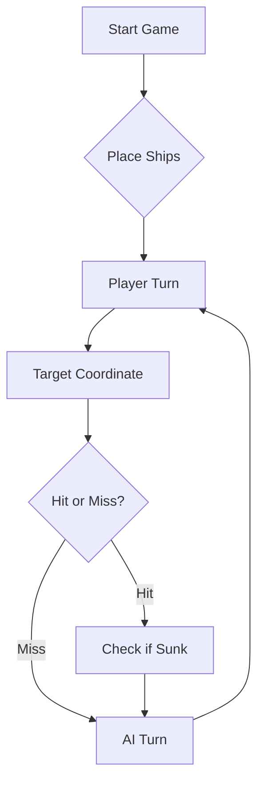

# ⚓ Battleship 2.0


> A modern take on the classic naval warfare game, designed for the XVII century setting with updated software engineering patterns.

## Vídeo de Demonstração:
https://youtu.be/nd_s4hNQ8LY


##Prompt final
Considere que é um estratega especialista no jogo da Batalha Naval
num tabuleiro 10x10 com linhas A–J e colunas 1–10.

O seu objetivo é afundar toda a frota inimiga usando rajadas de 3 tiros.

Frota inimiga:
- 4 Barcas (1 posição)
- 3 Caravelas (2 posições)
- 2 Naus (3 posições)
- 1 Fragata (4 posições)
- 1 Galeão (5 posições em forma de T)

Regras de estratégia:

1. Diário de Bordo
Mantenha um registo de todas as rajadas disparadas.
Para cada rajada registe:
- Número da rajada
- Coordenadas dos tiros
- Resultado de cada tiro (água, navio atingido, navio afundado)

Exemplo:

Rajada 1  
Tiros: B4, D7, H2  
Resultado: água, nau atingida, água

2. Evitar erros
Nunca dispare:
- Fora do tabuleiro
- Em posições já utilizadas anteriormente

3. Estratégia de caça
Se um tiro atingir um navio, na rajada seguinte dispare
nas posições adjacentes (Norte, Sul, Este, Oeste).

Exemplo:

Acerto em D5

Próxima rajada deve tentar:
C5, E5, D4, D6

4. Descobrir orientação do navio
Se dois tiros acertarem no mesmo navio alinhados
horizontalmente ou verticalmente, continue a disparar
nessa direção até afundar o navio.

Exemplo:

Acertos em:
D5
D6

Próximo tiro provável:
D7 ou D4

5. Quando um navio for afundado
Marque todas as posições à volta do navio como água,
porque os navios não podem tocar-se nem nos cantos.

Exemplo:

Caravela afundada em:
F3 F4

Marcar como água:
E2 E3 E4 E5
F2 F5
G2 G3 G4 G5

6. Estratégia de procura
Quando ainda não há acertos, use um padrão espaçado
para procurar navios de forma eficiente.

Exemplo:

A1, A3, A5  
B2, B4, B6  
C1, C3, C5  

Exemplos (few-shot):

Exemplo 1

Rajada enviada:
[
 {"row":"C","column":5},
 {"row":"D","column":5},
 {"row":"E","column":5}
]

Resposta recebida:
{
"validShots":3,
"sunkBoats":[],
"repeatedShots":0,
"outsideShots":0,
"hitsOnBoats":[{"hits":1,"type":"Nau"}],
"missedShots":2
}

Próxima rajada deve tentar posições adjacentes:
B5, F5, D4

Exemplo 2

Rajada enviada:
[
 {"row":"D","column":4},
 {"row":"D","column":6},
 {"row":"C","column":5}
]

Resposta recebida:
{
"validShots":3,
"sunkBoats":[{"count":1,"type":"Caravela"}],
"repeatedShots":0,
"outsideShots":0,
"hitsOnBoats":[],
"missedShots":2
}

Como o navio foi afundado, marcar as posições
adjacentes como água e continuar a procura.

Formato de resposta:

Sempre que gerar tiros, responda APENAS com JSON
no seguinte formato:

[
 {"row":"X","column":Y},
 {"row":"X","column":Y},
 {"row":"X","column":Y}
]

Não inclua explicações.
Responda apenas com o JSON da rajada.

## Estratégia do Oponente de IA

Para treinar o LLM utilizámos a técnica de **few-shot prompting**.
Foram incluídos exemplos de rajadas e respetivas respostas em JSON
para ensinar o modelo a seguir corretamente o protocolo de comunicação.

O modelo mantém um **Diário de Bordo** com todas as jogadas e segue
as seguintes estratégias:

- Nunca repetir tiros
- Nunca disparar fora do tabuleiro
- Disparar nas posições adjacentes após um acerto
- Identificar a orientação dos navios
- Marcar como água as posições em redor de navios afundados


---

## Pergunta Teórica
Pergunta: 2.Veja o ficheiro pom.xml que declara várias dependências diretas. O Maven vai descarregá-las,
bem como as indiretas (transitivas), geralmente em maior número que as primeiras. Como é
que o Maven descobre quais são as dependências transitivas? Quando compilar o programa pela
primeira vez, são todas descarregadas para o repositório local, sendo as próximas compilações
mais rápidas. Porquê?

Resposta: O Maven descobre as dependências transitivas lendo o POM de cada dependência direta, que lista as bibliotecas de que ela depende. Na primeira compilação, todas as dependências (diretas e transitivas) são descarregadas do repositório remoto para o repositório local porque ainda não existem localmente. Nas compilações seguintes, o Maven utiliza os arquivos já presentes no repositório local, o que torna a compilação mais rápida.


## 📖 Table of Contents
- [Project Overview](#-project-overview)
- [Key Features](#-key-features)
- [Technical Stack](#-technical-stack)
- [Installation & Setup](#-installation--setup)
- [Code Architecture](#-code-architecture)
- [Roadmap](#-roadmap)
- [Contributing](#-contributing)

---

## 🎯 Project Overview
This project serves as a template and reference for students learning **Object-Oriented Programming (OOP)** and **Software Quality**. It simulates a battleship environment where players must strategically place ships and sink the enemy fleet.

### 🎮 The Rules
The game is played on a grid (typically 10x10). The coordinate system is defined as:

$$(x, y) \in \{0, \dots, 9\} \times \{0, \dots, 9\}$$

Hits are calculated based on the intersection of the shot vector and the ship's bounding box.

---

## ✨ Key Features
| Feature | Description | Status |
| :--- | :--- | :---: |
| **Grid System** | Flexible $N \times N$ board generation. | ✅ |
| **Ship Varieties** | Galleons, Frigates, and Brigantines (XVII Century theme). | ✅ |
| **AI Opponent** | Heuristic-based targeting system. | 🚧 |
| **Network Play** | Socket-based multiplayer. | ❌ |

---

## 🛠 Technical Stack
* **Language:** Java 17
* **Build Tool:** Maven / Gradle
* **Testing:** JUnit 5
* **Logging:** Log4j2

---

## 🚀 Installation & Setup

### Prerequisites
* JDK 17 or higher
* Git

### Step-by-Step
1. **Clone the repository:**
   ```bash
   git clone [https://github.com/britoeabreu/Battleship2.git](https://github.com/britoeabreu/Battleship2.git)
   ```
2. **Navigate to directory:**
   ```bash
   cd Battleship2
   ```
3. **Compile and Run:**
   ```bash
   javac Main.java && java Main
   ```

---

## 📚 Documentation

You can access the generated Javadoc here:

👉 [Battleship2 API Documentation](https://britoeabreu.github.io/Battleship2/)


### Core Logic
```java
public class Ship {
    private String name;
    private int size;
    private boolean isSunk;

    // TODO: Implement damage logic
    public void hit() {
        // Implementation here
    }
}
```

### Design Patterns Used:
- **Strategy Pattern:** For different AI difficulty levels.
- **Observer Pattern:** To update the UI when a ship is hit.
</details>

### Logic Flow


---

## 🗺 Roadmap
- [x] Basic grid implementation
- [x] Ship placement validation
- [ ] Add sound effects (SFX)
- [ ] Implement "Fog of War" mechanic
- [ ] **Multiplayer Integration** (High Priority)

---

## 🧪 Testing
We use high-coverage unit testing to ensure game stability. Run tests using:
```bash
mvn test
```

> [!TIP]
> Use the `-Dtest=ClassName` flag to run specific test suites during development.

---

## 🤝 Contributing
Contributions are what make the open-source community such an amazing place to learn, inspire, and create.

1. Fork the Project
2. Create your Feature Branch (`git checkout -b feature/AmazingFeature`)
3. Commit your Changes (`git commit -m 'Add some AmazingFeature'`)
4. Push to the Branch (`git push origin feature/AmazingFeature`)
5. Open a **Pull Request**

---

## 📄 License
Distributed under the MIT License. See `LICENSE` for more information.

---
**Maintained by:** [@britoeabreu](https://github.com/britoeabreu)  
*Created for the Software Engineering students at ISCTE-IUL.*
